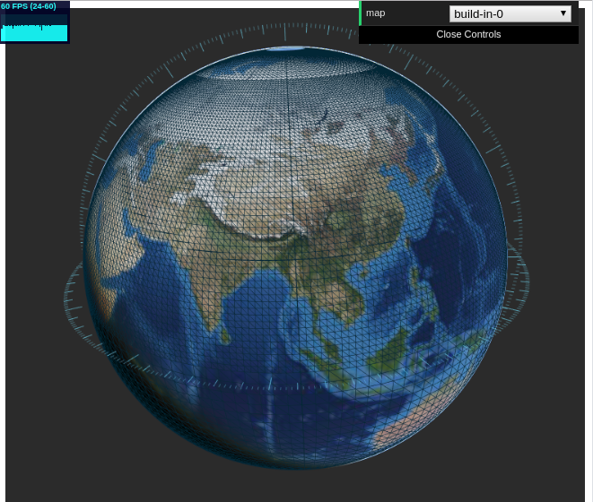
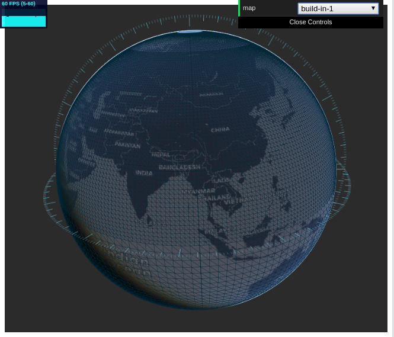
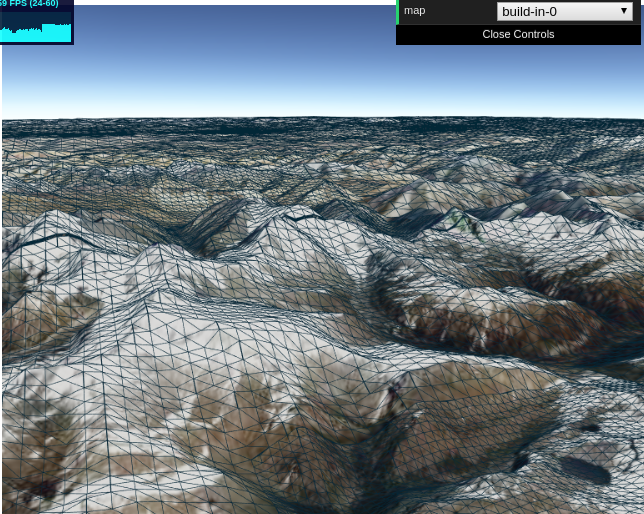

# webgis

- web based Geographic Information System.
- Light and fast.

## [Live Demo](https://jingbogit.github.io/webgis/)

______________

## Earth

Infinite subdivided earth with Terrian.

## Map

Switch to different map resources.

## Terrain

Zoom-in closer to the earth, and you'll see the terrian.

